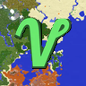

# VoxyMap

Fabric mod for Minecraft 26.2. Projects [Voxy](https://modrinth.com/mod/voxy)'s stored voxel data
onto [Xaero's World Map](https://modrinth.com/mod/xaeros-world-map), so the map fills in with
terrain you've seen from a distance but never actually walked through. It never touches a tile
Xaero scanned for real — if Xaero later re-scans ground this mod filled in, Xaero's version wins.

Not affiliated with either mod. Both need to be installed for this to do anything; see
[Requirements](#requirements).



## Why

Voxy keeps a full-detail voxel database of everything the client has ever streamed, well past
Xaero's own draw distance. Xaero only draws what its writer has physically walked over. This mod
reads the former and writes the latter, using Xaero's own colour/classification logic so the
seam between "actually scanned" and "filled in" tiles doesn't show.

On a server, the client's Voxy database only holds what render distance already streamed to it —
not much to work with. The optional server half fixes that by pregenerating chunks ahead of
players and streaming the resulting voxel data down, so there's something for the client side to
draw from.

## Requirements

- Fabric Loader, Fabric API, Java 25
- [Voxy](https://modrinth.com/mod/voxy) 0.2.18-beta and
  [Xaero's World Map](https://modrinth.com/mod/xaeros-world-map) 1.44.x — not hard dependencies,
  but nothing happens without them
- One jar goes on both client and server. The server-side pregen/streaming half works with just
  Voxy present server-side.

## Installing

Drop the jar in `mods/` alongside Voxy and Xaero's World Map. That's it — it starts sweeping about
15 seconds after you join a world and keeps going in the background. Nothing shows on the HUD;
progress goes to the log and to `/voxymap status`.

With Sodium installed, **Video Settings → VoxyMap** has a speed preset (Background / Balanced /
Fast) and a framerate floor below which filling pauses.

## Commands

| Command | Does |
| --- | --- |
| `/voxymap status` | What the bridge can see — Voxy's database, Xaero's write gates. Start here. |
| `/voxymap here [chunks]` | Author one tile chunk ahead of where you're facing. Cheap first test. |
| `/voxymap region <x> <z>` | Sweep one Xaero region on demand. |
| `/voxymap start` / `stop` | Full sweep of the current dimension / suspend it. |
| `/voxymap probe [x z]` | Dump Xaero's live in-memory state for a region. |
| `/voxymap wipe` | Delete this mod's + Voxy's data for the current world. Requires `wipe confirm`. |
| `/voxymapserver pregen` | Server-side chunk pregen status and live tuning (op only). |
| `/voxymapserver resend` | Force a full re-send of streamed LOD to every connected player. |

Full command reference, config keys, and the implementation notes (how tile ownership is decided,
why slopes come out right for free, the streaming protocol) are in [readme-claude.md](readme-claude.md).

## Known limitations

- Overworld and End only by default — the Nether uses a different column model this mod doesn't
  implement yet (`--force` will try anyway; it'll look wrong).
- Waterlogged blocks lose their water overlay. Open water, lakes, and lava render fine.
- Lighting reflects conditions when Voxy ingested that ground, not the current time of day.
- Pre-alpha. Debug logging is on by default and commands/config may still change.

## Building

```bash
bash build.sh
```

Plain `javac` + `jar`, no Gradle or Loom — 26.2's intermediary mapping is the identity mapping, so
there's no remap step. `build.sh` needs a JDK 25 on `PATH` (or `JAVA_HOME`) and a set of
dependency jars to compile against, all dropped into a `deps/` folder next to `build.sh` (or
pointed to with `VOXYMAP_DEPS_DIR`):

- The Minecraft 26.2 client jar and its libraries
- `voxy-0.2.18-beta.jar`
- `xaeroworldmap-fabric-26.2-1.44.2.jar`
- `sodium-fabric-0.9.1+mc26.2.jar`
- The Fabric API submodules: `fabric-api-base-2.0.4+ece063239e.jar`,
  `fabric-command-api-v2-3.1.0+00cb03469e.jar`, `fabric-lifecycle-events-v1-4.1.3+4575b05f9e.jar`,
  `fabric-networking-api-v1-6.3.3+72073ef09e.jar`, `fabric-rendering-v1-25.3.1+6988455e9e.jar`
- `xaerolib-fabric-26.2-1.7.1.jar` — jar-in-jar'd inside Xaero's World Map, pull it out with
  `unzip -o -j xaeroworldmap-fabric-26.2-1.44.2.jar 'META-INF/jars/xaerolib-*.jar' -d deps`

Output goes to `dist/voxymap-<version>.jar`.

## License

MIT — see [LICENSE](LICENSE).
